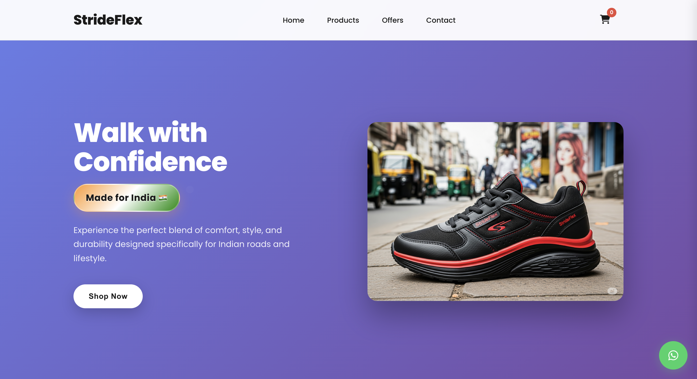
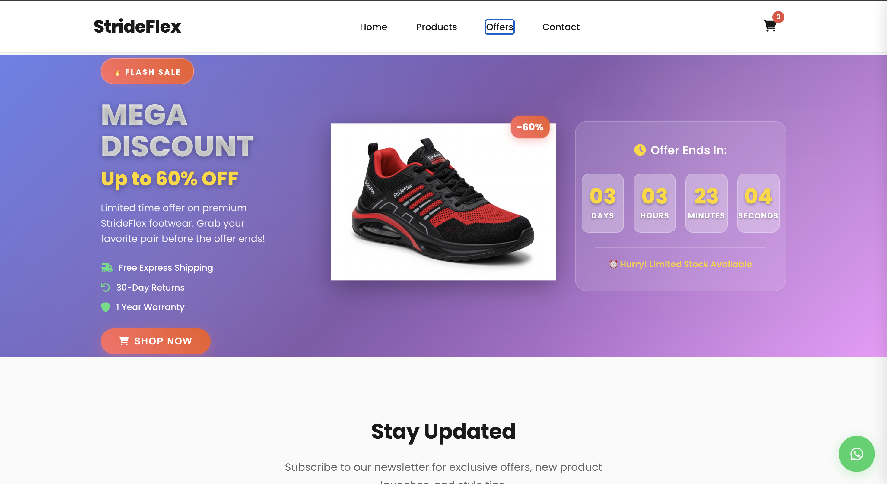
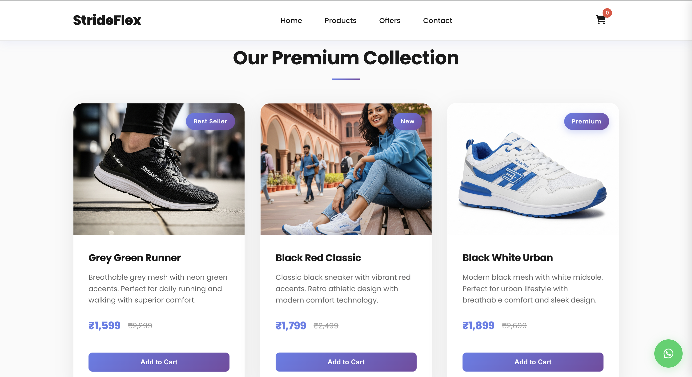

# StrideFlex 👟

### Modern Indian Footwear Brand Website

StrideFlex is a modern and responsive footwear landing page inspired by popular Indian ecommerce brands like Campus, Sparx, and RedTape.

The project focuses on creating a clean shopping experience with bold visuals, smooth animations, responsive layouts, and interactive sections using only HTML, CSS, and JavaScript.

Designed with a modern Indian ecommerce style, the website works smoothly across desktop, tablet, and mobile devices.

---

## 🚀 Live Demo

🔗 (https://strideflex.netlify.app/)

---

## 📸 Screenshots

### Homepage

<p align="center">
  
</p>

### Offers Section

<p align="center">
  
</p>

### Products Section

<p align="center">
  
</p>

---

## ✨ Features

- Fully responsive design
- Modern ecommerce-style UI
- Hero banner section
- Product showcase cards
- Promotional offers section
- Countdown timer
- Newsletter subscription form
- Contact form with validation
- Smooth scrolling navigation
- Interactive hover effects
- Floating WhatsApp support button
- Mobile-friendly navigation menu

---

## 🛠️ Technologies Used

- HTML5
- CSS3
- JavaScript (ES6)
- Font Awesome
- Google Fonts

---

## 🎨 Design Highlights

- Clean red, black, and white color theme
- Inspired by Indian footwear ecommerce websites
- Modern typography using Poppins font
- Responsive grid layouts
- Smooth transitions and animations

---

## 📂 Project Structure

```bash
StrideFlex/
│
├── index.html
├── styles.css
├── script.js
├── Homepage.png
├── Offers.png
├── Products.png
└── README.md
```

---

## 📱 Responsive Design

The website is optimized for:

- Desktop devices
- Tablets
- Mobile screens

The layout automatically adjusts for different screen sizes to provide a seamless user experience.

---

## ⚡ How to Run the Project

1. Clone the repository

```bash
git clone https://github.com/your-username/strideflex.git
```

2. Open the project folder

```bash
cd strideflex
```

3. Run the website

Open `index.html` in your browser.

---

## 💡 Future Improvements

- Add shopping cart functionality
- Integrate payment gateway
- Add product filtering
- Add dark mode
- Connect backend database
- Add user authentication

---

## 🙌 Author

Developed by Navin Bohara

---

## 📄 License

This project is open source and available under the MIT License.

---

## ⭐ Support

If you like this project, consider giving it a ⭐ on GitHub.
